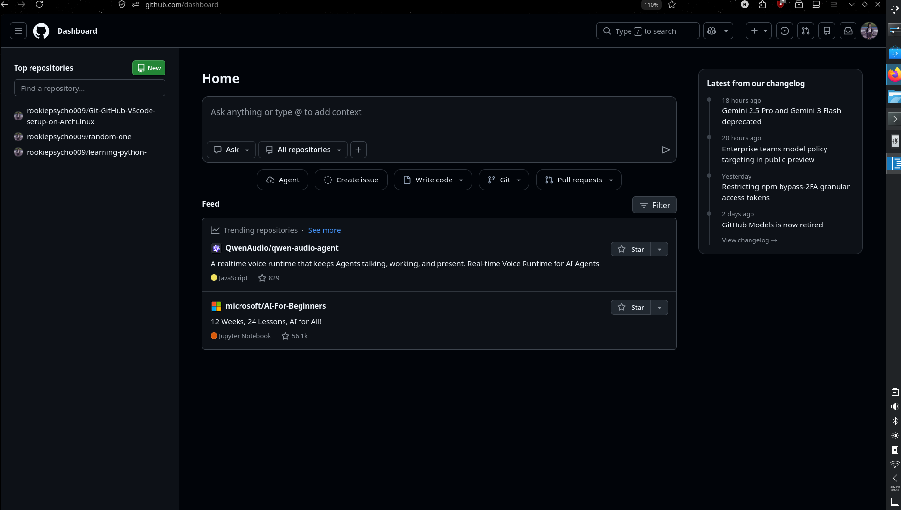
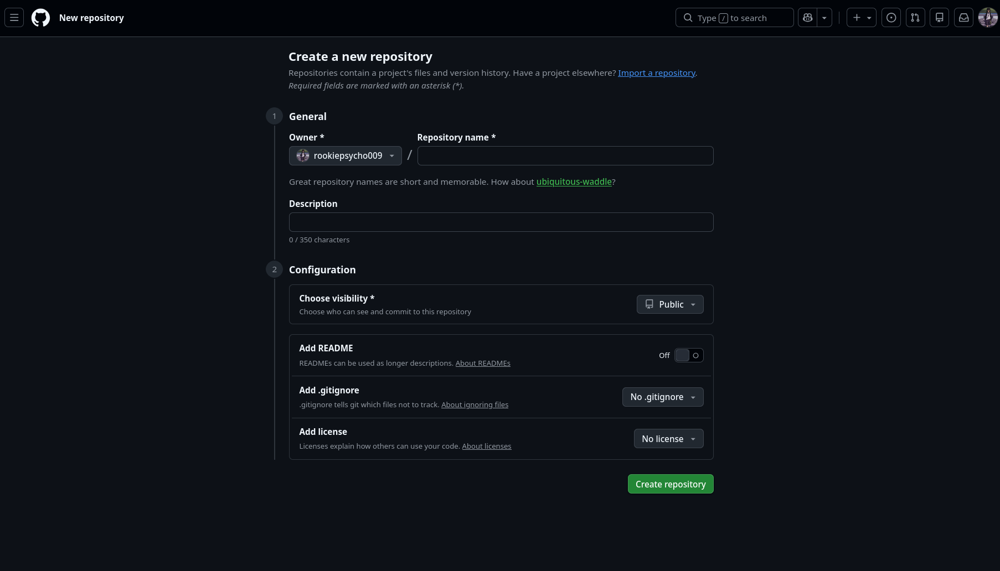

> <h1>Git-GitHub-CodeOSS-ON-Arch-Linux

<p>This is a repo where I'm going to describe how to install git and Code-OSS and then integrate them with GitHub for maximum workflow.</p>

## Table of contents 
- [Introduction](#introduction)
- [How To Install](#how-to-install)
- [How To Configure](#how-to-configure)
- [Workflow](#workflow)
- [Conclusion](#conclusion)

# Introduction

<h2>Git</h2>

> Git is a distributed version control system. It tracks every change you make to your code (or any files) so you can:

- Go back to any previous version
- Work on different features in parallel (branches)
- Merge changes safely
- See exactly what changed and when

Git runs completely on your computer. You don’t need an internet connection to use it.

<h2>GitHub</h2>


> GitHub is a web-based platform built on top of Git. It gives you:

- Remote storage for your repositories
- Collaboration tools (pull requests, issues, code review)
- Free hosting for open-source projects
- Integration with CI/CD, project boards, and more

Think of Git as the tool that manages your code history, and GitHub as the place where you store, share, and collaborate on that code with others.


<h2>Code-OSS</h2>

> code - OSS is the open-source version of Visual Studio Code. It is the version available in the official Arch repositories.


Key advantages on Arch:

- Fully open-source
- Available directly from the official repos
- Excellent Git integration
- Huge extension ecosystem
- Lightweight, fast, and highly customizable
- Perfect terminal integration

> [!NOTE] 
> The proprietary Microsoft version is available via AUR (visual-studio-code-bin), but this guide focuses on Code - OSS.

# How To Install 

> Open your terminal and type:


```bash
sudo pacman -Syu                   #To update your system 
sudo pacman -S git                 #To Install git 
git --version                      #To verify git installation 
sudo pacman -S code                #To install Code-OSS 
code                               #To launch code 
```

# How To Configure 

> <h3>GitHub</h3>
Open your browser and type [github.com](https://github.com/) There you will see this type of interface : 



Now, you have to SignUp first and then click on the green button to open a new repository. Initially you won't have any repo, So, welcome to your first repo. This is where you are going to store your code, manage versions and colleborate with others. 

After clicking the <span style="color:green">New</span> button you will end up here: 



Give it a name,description and add readme and then hit create repository .


### Great ! You have officially created your first repo. Then comes the interesting part 


> <h3>Git</h3>

Fist of all we need to configure your git profile. For that, open your terminal and type 

```bash 
git config --global user.name "Your Name"
git config --global user.email "your.email@example.com"
git config --list   #To display all configuration settings 
```
Then create a folder named gittest on your desktop or any other folder. 
Open Code-OSS by typing 

```bash 
code 
```
Then open the folder you created. After that open your code-OSS terminal by pressing ctrl+`   

Then to add your GitHub repo to your local machine AKA your laptop or computer you need to use some git commands.Here are they: 
 

 ```bash 
 git clone the-https-link-of-your-repo
 ```
 > [!NOTE]
 > You will find the https link on your repo. Notice that there is a <span style="color:green">Code</span>
button there. Click on it and you will find the link. Just copy and paste it. 

The repo will come to the folder that you have created. There you will see your README.md file.If you type cd (change directory) on your terminal and type the name of your repo you will enter on that file 

After that create any file with any language, code, edit. Then on your Code-OSS terminal type


```bash 
git status      #To check the changes that you made
git add .       #To save those chnages 
git commit -m "name-you-want-for-that-change"
git push origin main 
```

After that come to your repo, refresh it and you will see that the changes you made on your local machine are on your repo....


# Workflow 

1.Open a github repository   
2.Clone it on Code-OSS via git   
3.Upload the chnages on github   
4.Collaborate with others 


# Conclusion 

This is how you can access your code from anywhere you want. And a clean arch-linux code development setup..


> [!WARNING]
> If you have come this far I want you to know that this is the first time I am making a tutorial. So, there is going to be a lot of mistakes. But I will try to update this repo whenever I get time. Also feel free to indentify any issue and contribute if you want..


> Thanks for reading!! 


